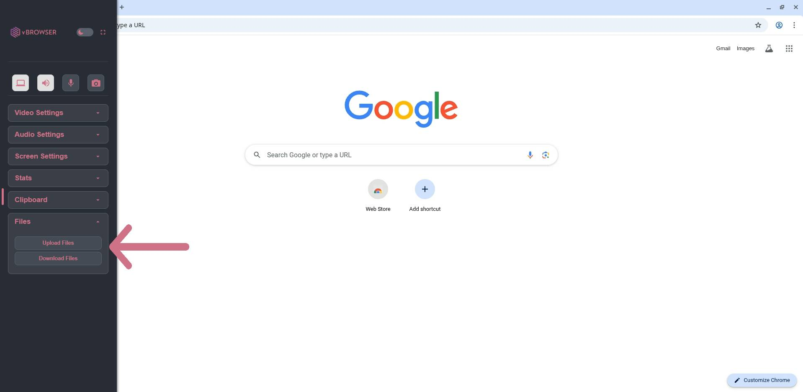

## Upload Files

1. Open the left-side menu.
2. Select **Files**.
3. Click **Upload Files**.

:::warning
Uploads are restricted to `/config/Desktop`.
:::

## Download Files

:::danger

By performing this action, you will be actively downloading files from the session into a non-password-protected ZIP file. These files are offered “as-is” and may contain malicious content. By downloading, you acknowledge and accept all risks, confirm you have the necessary knowledge to handle potentially harmful files, and agree that you are solely responsible for any resulting damage or loss. We disclaim all liability for any security breaches, malware, or other adverse effects. It is strongly recommended that you use up-to-date antivirus software and other security measures.

:::

1. Select **Download Files**.
2. Choose the file to download.

## Next Steps

To understand how idle timeouts work:

Continue to **Idle Timeouts**