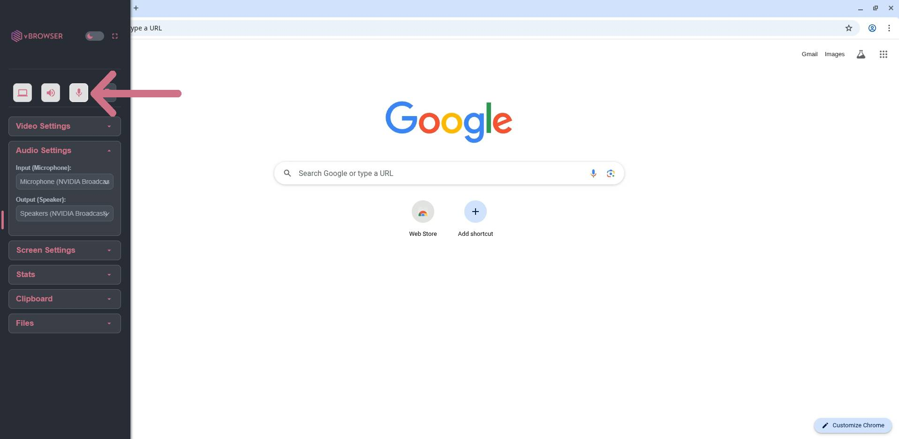
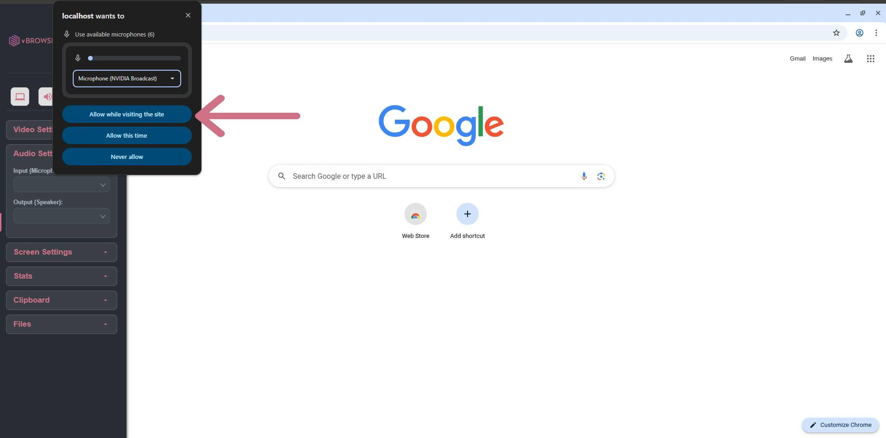

## Microphone

1. Open the left-side menu.
2. Select **Audio Settings**.
3. Enable microphone access.

4. You will likely be prompted to accept/allow microphone permissions as seen below. You **must** allow microphone permissions for audio to passthrough.

5. Select your desired microphone input/output device.

## Audio Output

:::info

Audio output should be enabled by default.

:::

1. Click the speaker icon.
2. Allow audio permissions.

## Next Steps

To understand how screenshots work:

Continue to **Screenshots**